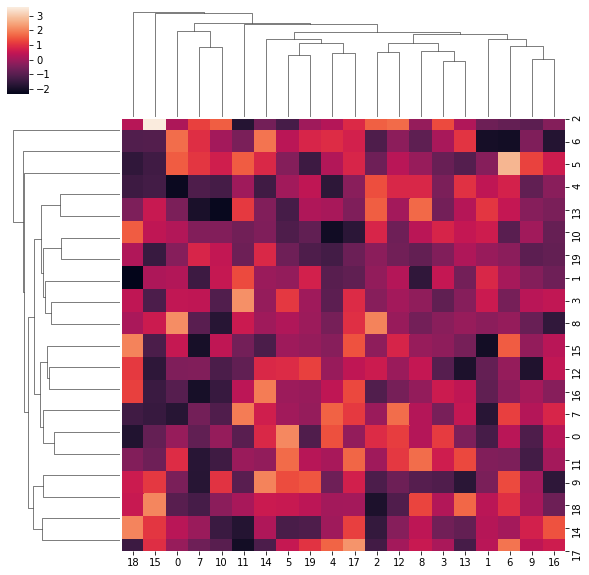

the new way of writin posts


```python
import numpy as np, seaborn as sns
```


```python
sns.clustermap(np.random.randn(20,20))
```


    <seaborn.matrix.ClusterGrid at 0x1a17de8fd0>





```python

```
